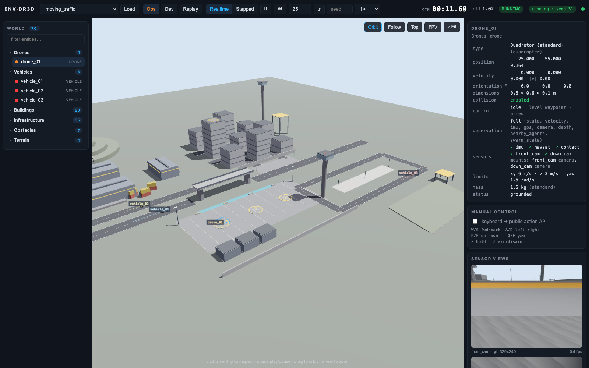
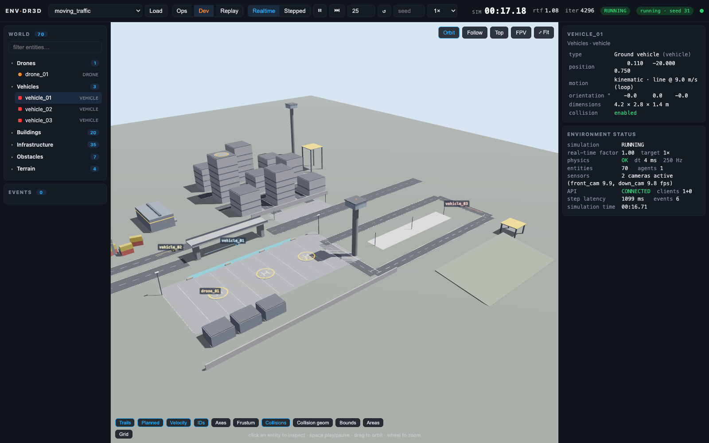
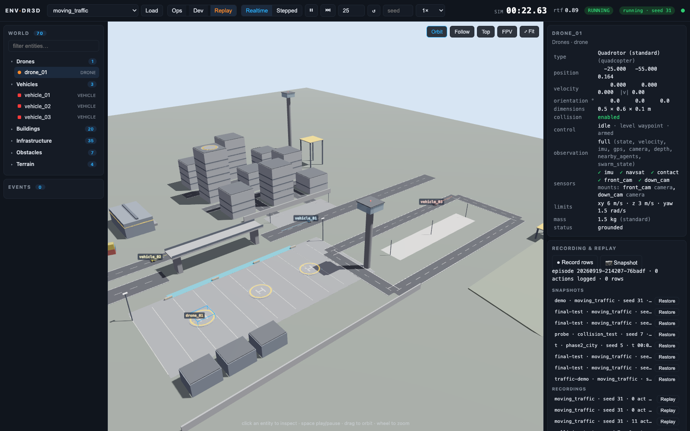
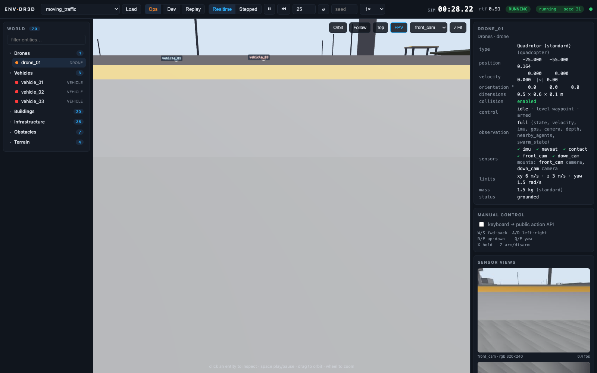

# env-dr3d — autonomous simulation world

A general-purpose autonomous-systems simulation platform: Gazebo Sim **Jetty**
(headless) behind an algorithm-agnostic Simulation API, with a browser control room
and a Python client. The simulator is authoritative; the browser only visualizes, and
external programs (scripts, controllers, RL / world-model codebases) talk only to the
API. **This repository is the environment.** Algorithms live in other codebases and
connect through `simclient`; `learn/` is kept as a worked example of such a codebase.



See [`briefs/brief-1.md`](briefs/brief-1.md) for the original goals and
[`docs/ARCHITECTURE.md`](docs/ARCHITECTURE.md) for the design and the decisions
behind it (why Jetty, why this control abstraction, stepping/determinism model).

```
sim/       worlds (SDF), scenarios (YAML), model templates
api/       Simulation API server (FastAPI + WebSocket) and the Gazebo engine adapter
client/    Python SDK for external controllers (HTTP only, no Gazebo knowledge)
web/       browser frontend (Vite + three.js)
examples/  external controllers (integration tests)
runs/      per-run artefacts: scenario.yaml, generated world.sdf, gz-server.log
tests/     API contract tests (run without Gazebo, using a fake engine)
```

---

## Prerequisites

- macOS on Apple Silicon (this has only been run on macOS 26 "Tahoe", arm64).
  There's no Linux/Docker path here — see `docs/SENSORS.md` for why that will
  matter once camera sensors are added.
- [Homebrew](https://brew.sh)
- [uv](https://docs.astral.sh/uv/) for the Python venv (`brew install uv` if you
  don't have it)
- Node.js + npm (`brew install node` if you don't have it)

## First-time setup

Run these once, in order, from the repo root.

**1. Install Gazebo Sim Jetty** (gz-sim 10) via the Open Robotics tap:

```bash
brew tap osrf/simulation
brew trust osrf/simulation
brew install osrf/simulation/gz-jetty
```

This pulls in Qt, OGRE, DART and ~35 other packages — expect several minutes on
first install. Verify it worked:

```bash
gz sim --versions        # should print 10.x.x
```

**2. Create the Python virtual environment.**

Gazebo's Python bindings (`gz.transport`, `gz.msgs`) are built by Homebrew
against its own `python@3.14`, so the venv must be created from that same
interpreter with access to its site-packages:

```bash
uv venv --python /opt/homebrew/opt/python@3.14/bin/python3.14 --system-site-packages .venv
uv pip install --python .venv/bin/python -e ".[dev]"
```

`pyproject.toml` pins `protobuf>=7.36,<8` to match the protobuf compiler
Homebrew used to generate the `gz.msgs` bindings. If you ever see an error like
`Detected incompatible Protobuf Gencode/Runtime versions`, it means something
downgraded protobuf in the venv — reinstall with the command above.

**3. Install the web frontend's dependencies:**

```bash
cd web && npm install && cd ..
```

**4. Sanity-check the whole toolchain** (optional but recommended — confirms
Gazebo, the Python bindings and the API all agree with each other):

```bash
.venv/bin/python -m pytest -q tests   # API contract tests, no Gazebo needed
```

---

## Starting the server

### Quick way

```bash
scripts/dev.sh
```

This starts the web dev server (http://127.0.0.1:5173) in the background and
the Simulation API (http://127.0.0.1:8000) in the foreground. Gazebo itself is
**not** started yet at this point — the API launches `gz sim -s` headless only
once a scenario is loaded (see "Using it" below). Leave this terminal open;
`Ctrl-C` stops the API (and, via its shutdown hook, any running Gazebo server).

### Manual way (if you want the two halves in separate terminals)

```bash
# terminal 1 — API + Gazebo
source .venv/bin/activate
export GZ_PARTITION=envdr3d
PYTHONPATH=api python -m simapi

# terminal 2 — web UI
cd web && npm run dev -- --host 127.0.0.1
```

Then open **http://127.0.0.1:5173** in a browser, and the OpenAPI docs at
**http://127.0.0.1:8000/docs**.

## Using it

1. In the browser's top bar, pick a scenario (start with `moving_traffic` or
   `free_flight`; see the scenario library below) and click **Load** — or equivalently:
   ```bash
   curl -X POST localhost:8000/simulation/load/moving_traffic
   ```
   This generates `runs/<timestamp>_<scenario>/world.sdf`, launches
   `gz sim -s -r` headless against it, and the browser starts rendering as soon
   as the scene is available.
2. Use the transport controls (▶ pause/resume, ⏭ step, ↺ reset) or drive a
   drone from outside the browser with the example controller:
   ```bash
   .venv/bin/python examples/waypoint_controller.py --agent drone_01 --waypoint 8,4,6
   ```
   This is the Phase-1D integration test: take off → fly to waypoint → hover →
   land, driven entirely through the HTTP API (`client/simclient`), with no
   knowledge of Gazebo.

## Stopping everything cleanly

`Ctrl-C` in the `scripts/dev.sh` terminal stops the API and its Gazebo child.
If something was left running in the background (e.g. after a crashed
terminal), clean up with:

```bash
pkill -f "simapi"          # matches the API process regardless of which Python binary ran it
pkill -f "gz-sim-main"
pkill -f "npm run dev"
```

(Homebrew's `python@3.14` binary is named `Python`, capitalized, so a pattern
like `"python -m simapi"` can silently fail to match — `"simapi"` alone is
robust to that.)

Then confirm nothing is still listening:

```bash
lsof -nP -iTCP:8000 -iTCP:5173 -sTCP:LISTEN
```

## Troubleshooting

| Symptom | Likely cause | Fix |
|---|---|---|
| `Detected incompatible Protobuf Gencode/Runtime versions` | venv's `protobuf` package doesn't match Homebrew's protoc | `uv pip install --python .venv/bin/python "protobuf>=7.36,<8"` |
| `ModuleNotFoundError: No module named 'gz'` | venv wasn't created with `--system-site-packages` against Homebrew's python@3.14 | recreate the venv per step 2 above |
| API hangs on `/simulation/load/...` | a previous `gz-sim-main` from an earlier run is still alive and holding the transport partition | `pkill -f gz-sim-main`, wait a couple seconds, retry |
| `pkill -f "python -m simapi"` doesn't kill anything | Homebrew's python@3.14 binary is capitalized (`Python`), so a lowercase pattern won't match | use `pkill -f "simapi"` instead (case-insensitive to the binary name) |
| `address already in use` on port 8000/5173 | a previous server process wasn't stopped | run the cleanup commands above, then re-check with `lsof` |
| Browser shows nothing after Load | scenario hasn't finished spawning yet (first `gz sim` launch after a fresh install can take ~20s; later launches are ~3s) | wait a few seconds, check `runs/<latest>/gz-server.log` for errors |
| `status.running` is false, episode `failed`, event `simulator_crashed` | the Gazebo process died (its stack trace is in `runs/<latest>/gz-server.log`) | `POST /episode/reset` (or the ↺ button) relaunches the scenario automatically |
| Reset with cameras attached takes ~3 s | Gazebo re-initialises the rendering system on every world rewind | expected; use a camera-less scenario for fast RL loops or batch resets |

## Phase 2 — the environment loop

Phase 2 turns the platform into an *environment*: observations in, actions out,
episodes, events, two time modes. Full contract: [`docs/API.md`](docs/API.md).

```python
from simclient import Simulation            # client/ — HTTP only, no Gazebo knowledge

sim = Simulation("localhost")
episode = sim.reset(scenario="phase2_city", seed=42, mode="stepped")
obs = sim.observe("drone_01")
while not episode.done:
    action = controller(obs)                # e.g. sim.velocity(vx=1.0, vz=0.5) or sim.waypoint(8, 4, 6)
    result = sim.step(agent="drone_01", action=action, steps=25)   # exactly 25 physics iterations
    obs, episode = result.observations["drone_01"], result.episode
    for e in result.events: ...             # collision / landing / takeoff / out_of_bounds / timeout
```

Key ideas:

* **Observation profiles** decide what an agent may see (`state`, `navigation`,
  `vision`, `minimal`, `shared`, `central`, or scenario-defined). Ground truth
  stays available separately at `/entities/{id}`.
* **Actions** are validated (`velocity`, `waypoint`, `hold`, `arm`; limits per
  agent); bad actions return 422 and never reach the simulator.
* **Modes**: `realtime` (free-running, for humans) and `stepped` (advances only
  on `step`, for RL/planning/datasets).
* **Episodes** carry `episode_id / scenario / seed / mode / status`; every
  episode logs `runs/<run>/episode_<id>.jsonl` (state, action, events per step).
* **Events** are raw environment facts, not rewards.
* **Dynamic entities** (a circling target, a patrolling vehicle) move on their
  own along deterministic trajectories declared in the scenario.
* **Sensors**: RGB + depth frames over HTTP or a binary WebSocket, the same
  frames the browser shows.

### Browser

Realtime/Stepped toggle, play/pause/step/reset (seed box), entity list,
telemetry with observation profile and control mode, events log with collision
markers, Orbit/Follow/Top/FPV cameras, overlays (trails, velocity vectors, IDs,
axes, camera frustum, collision geometry, bounds), RGB/depth sensor panel, a
health strip (`/metrics`) and **manual keyboard flight** that goes through the
same public action API as any Python controller (W/S/A/D, R/F, Q/E, X hold,
Z arm/disarm; tick *Manual control* on a selected agent).

The camera auto-frames the agent cluster on load/reset instead of a wide,
mostly-empty establishing shot, agent labels/markers keep a constant on-screen
size regardless of distance so a drone never shrinks to an invisible speck,
and a **Fit view** button recentres on all agents at any time (useful after
one flies out of frame — there is no off-screen indicator yet, see Known limits).

### Example controllers (`examples/`)

```bash
.venv/bin/python examples/hover.py                 # climb + hold (realtime)
.venv/bin/python examples/waypoint_controller.py   # external P controller, stepped
.venv/bin/python examples/circle.py                # track a circular reference, stepped
.venv/bin/python examples/formation.py             # three drones in a triangle, stepped
.venv/bin/python examples/success_test.py          # brief 2 §29 checklist end to end
```

### Tests

```bash
.venv/bin/python -m pytest -q tests/test_api_fake_engine.py   # API contract, no Gazebo (fast)
.venv/bin/python -m pytest -q tests/integration                # real Gazebo: lifecycle, agents,
                                                               # reproducibility, collisions, frames (~3 min)
```

## Phase 3b — environment completeness & world building

The `autonomous_city` world is a small autonomous-operations test facility with five
areas (operations pads/apron/tower, urban grid, industrial warehouses/tanks/containers,
open field with a test track, hill and elevated structures), generated from a
parameterised asset library ([`sim/assets/`](sim/assets/), [`sim/worlds/autonomous_city.py`](sim/worlds/autonomous_city.py)).
Lighting presets `morning | day | evening | night`, fog/visibility and wind are scenario
settings; the browser matches the world's sky and sun.

**Scenario library** ([`sim/scenarios/`](sim/scenarios/)): `free_flight`, `urban_navigation`,
`vertical_navigation`, `moving_traffic`, `multi_agent`, `landing_operations`, `pursuit_arena`,
plus `entity_showcase`. Scenarios can declare seeded randomisation of agent spawns,
entity positions and route choices; the same seed reproduces the same draw.

**Entities**: three drone types (`standard`, `light`, `heavy`; consistent mass/inertia/rotor
constants and type-specific limits), configurable **sensor mounts** (named cameras/depth
at any pose), vehicles, targets, moving platforms, rotating beacons, static obstacles —
all spawnable at runtime with deterministic trajectories (`circle | line | waypoints | rotate`).
`GET /entities/{id}/detail` powers the inspector: category, type, dimensions, collision,
trajectory, control, sensors, physical parameters.

**State, recording, snapshots, replay** ([`docs/API.md`](docs/API.md)): `GET /world/state`;
every applied action and spawn/remove/teleport is logged per episode; optional per-step
*rows* (states, observations, events) form a replay buffer external learners pull
incrementally; **snapshots** are replay-based (reset + re-apply the log) and restore
exactly (0.0 m divergence) so experiments can branch from identical states; recordings
replay deterministically.

### Browser

| Operations | Development |
|---|---|
|  |  |

| Replay | FPV (drone camera) |
|---|---|
|  |  |

Three presentation modes (**Ops** clean view · **Dev** overlays, status, events · **Replay**
recordings and snapshots), an explicit simulation clock, speed multiplier (¼× … max),
Realtime/Stepped, step/reset/seed, a world **hierarchy** grouped by category, an
**inspector**, Orbit/Follow/Top/FPV cameras with smooth transitions and a Fit button,
per-mount **sensor views**, planned-path and trail overlays, and an **environment status**
panel (RTF, physics rate, entities, sensors, API, clients, latency). Deep links:
`/#view=development&select=drone_01&cam=follow`.

### Final environment test (brief 3b §43, zero AI)

```bash
.venv/bin/python examples/final_environment_test.py
```

Loads a scenario, spawns 3 drones / 2 vehicles / a moving target among 20+ structures,
drives one drone human-style, one from Python and one on a scripted path, then checks
telemetry, sensor feeds, the clock, pause/step, record → snapshot → diverge → **restore
exactly**, replay, and reset-with-same-seed reproducibility.

## Phase 3 — the first learned agent

The learning layer lives in [`learn/envdr3d_learn/`](learn/envdr3d_learn/) and
depends only on `simclient`; the simulator contains no RL logic. Details:
[`docs/LEARNING.md`](docs/LEARNING.md).

```python
from simclient import Simulation
from envdr3d_learn import NavigationTask, TaskConfig

task = NavigationTask(Simulation("localhost"), TaskConfig(level="open", observation="state"))
obs, info = task.reset(seed=3)                     # random start + target, drone teleported & armed
while True:
    obs, reward, terminated, truncated, info = task.step(policy(obs))   # action: world-frame velocity in [-1,1]^3
    if terminated or truncated: break               # reached | collision | out_of_bounds | timeout | truncated
```

* **Task**: point-to-point navigation, three levels (`open`, `pillars`, `city`),
  randomised start/target, configurable reward and success/failure outside the simulator.
* **Observation modes**: `state` (privileged), `navigation` (GPS/IMU/velocity),
  `vision` (camera + depth + IMU + GPS); same 12-d task vector, different sources.
* **Baselines**: `random` and the engineered `waypoint` controller, evaluated on the
  same fixed sets as any learned policy.
* **Training**: `python -m envdr3d_learn.train_ppo` (stable-baselines3 PPO, N parallel
  simulators, periodic evaluation on the fixed set, checkpoints, experiment.json).
* **Evaluation**: fixed, seeded sets in `eval_sets/` (unseen during training);
  metrics: success/collision/timeout rates, time to target, path efficiency,
  final distance, action smoothness; per-episode traces for failure analysis.
* **Datasets**: `python -m envdr3d_learn.record` writes `obs_t, a_t, obs_{t+1}` aligned
  `.npz` trajectories (demonstrations from the waypoint controller included).
* **Demo**: `python examples/demo_policy.py --policy <waypoint|model.zip>` plays a policy
  in the browser at real-time pace with a task overlay (target ring, distance, reward, action).

### Results (Level 1, open field, fixed 20-pair evaluation set)

Experiment A (state observations, open field, randomised start/target; evaluation on 20 fixed pairs never seen in training).
Experiment `20260919-160520_ppo_open_state_v3_ce30`: PPO, 150k steps, 4 parallel simulators, ~36 min wall on a laptop.

| policy | success | collision | time to target (s) | path eff. | final dist (m) | action Δ |
|---|---|---|---|---|---|---|
| **PPO (learned, frozen)** | 1.00 | 0.00 | 8.6 | 0.98 | 0.91 | 0.008 |
| waypoint controller (engineered) | 1.00 | 0.00 | 8.6 | 1.00 | 0.83 | 0.002 |
| random | 0.00 | 0.00 | — | — | 21.57 | 0.664 |

Success on the 10-pair evaluation subset during training: 0%@25k → 60%@50k → 90%@75k → 100%@100k → 100%@125k → 100%@150k.

Two earlier runs failed and were diagnosed with the trace tooling (see
[`docs/LEARNING.md`](docs/LEARNING.md), *Lessons*): a reward-shaping problem and a
task-layer bug where saturated actions were rejected by the simulator's limits.

Level 2 (pillars) baseline: the straight-line waypoint controller collides in 15/20
episodes (20 % success) — obstacle navigation is a real, measurable problem for
Experiment B.

## Status (2026-09-19) — vertical slice verified

Gazebo → API → external Python controller → drone moves → browser sees it: **working.**

* Headless `gz sim -s` (Jetty 10.5.0) launched from a scenario; RTF ≈ 1.0 with two quadcopters.
* `examples/waypoint_controller.py` passes for `drone_01` and `drone_02` simultaneously
  (take off → waypoint → hover → land within ~5 cm).
* Pause / resume / blocking `step(N)` / reset via REST and WebSocket; three
  `reset → action → step(500)` runs give bit-identical positions.
* Runtime spawn/remove of extra drones (`POST /entities`, `DELETE /entities/{id}`).
* Browser: 3D world from the scene service, 25 Hz pose stream, entity list,
  telemetry panel (pose, world velocity, attitude, IMU), orbit/follow/top cameras.
* Every run writes `runs/<stamp>_<scenario>/{scenario.yaml,world.sdf,gz-server.log}`.

Not yet: recording/replay beyond the per-episode JSONL log, the nicer city, and an
on-screen indicator for agents that fly outside the current view (mitigated by the
Fit view button, see the browser section above).

## Tests

```bash
.venv/bin/python -m pytest -q tests          # API contract tests with a fake engine (no Gazebo needed)
```
